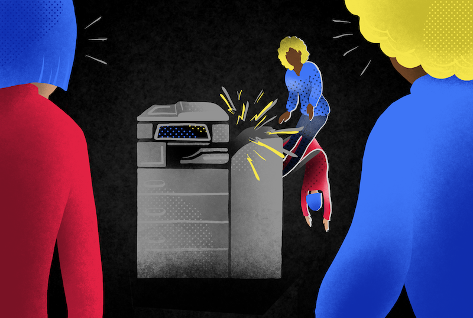
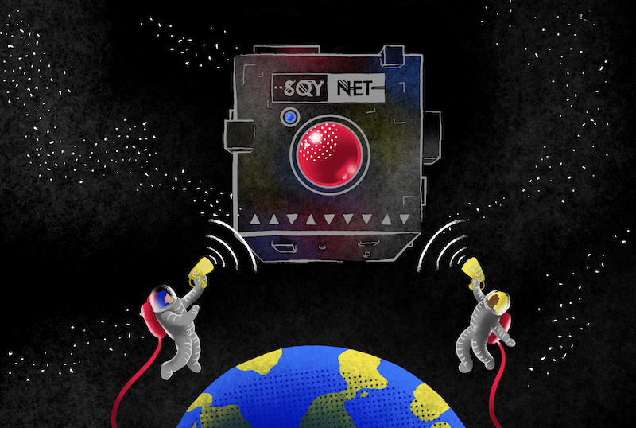

# Coding Metastory

Welcome to the QHack Coding Challenges metastory! This page gives a brief overview of the heroes, villains, and juicy quantum computing content you can expect to find in our problems. Each category consists of five loosely connected challenges, increasing in difficulty. None of them strictly depends on the others, and may be attempted in any order. If you like a good linear yarn, feel free to go through them in order. If you prefer your narratives nonlinear, pop back here to get a sense of the overall arc!

Visit the [main page](https://qhack.ai/) to register. Once you've created an account and joined a team, you can access the problems from our [challenge platform](https://qhack.ai/dashboard/challenges).

## Office Hijinks

These days, quantum computing is everywhere, even in the office! At Trine's Designs, workers use quantum computing for whimsical and occasionally ridiculous purposes. Two star employees, Zenda and Reece, get to build clocks, fix coffee machines, do network planning, and even unmask a lazy coworker! Join them in a world of patently absurd patents and low-stakes hijinks.

## Bending Bennett's Laws

The eccentric inventor behind Trine's Designs, Doc Trine, has a new invention: timbits! But ever the fan of excursions, diversions, divagations and explanations, she insists that Zenda and Reece must cover the basic laws governing quantum information before learning about timbits. They will encounter reversible computation, encryption, causality, and find out how to use a photocopier to simplify quantum circuits! But beware: this shaggy doc story may leave a 'bit' to be desired.

## A Tale of Timbits

Doc Trine has been apprehended by freelance security analyst Ove A. Heard, and placed in a hyperdimensional jail for future crimes against time. To determine Trine's location and rescue her, Zenda and Reece will need to build useful tools from the janky old equipment lying around the office. You can aid them in their quest to dust off an 8-ball, identify mystery boxes, build a quantum radar and even assemble an entangled robot swarm. Your reward: timbits, a resource powerful enough to solve NP problems and punch a hole in the spacetime continuum!

## The Fall of Sqynet

Zenda and Reece fall through a crack in spacetime to discover that Sqynet, a conscious quantum computer, is threatening to wipe out life in our galaxy as we know it. The Rebel Alliance has entrusted Zenda and Reece with a treacherous task: destroying Sqynet once and for all. Having collected some data about Sqynet's hardware, let's now help them devise some strategies to vanquish this galactic threat!