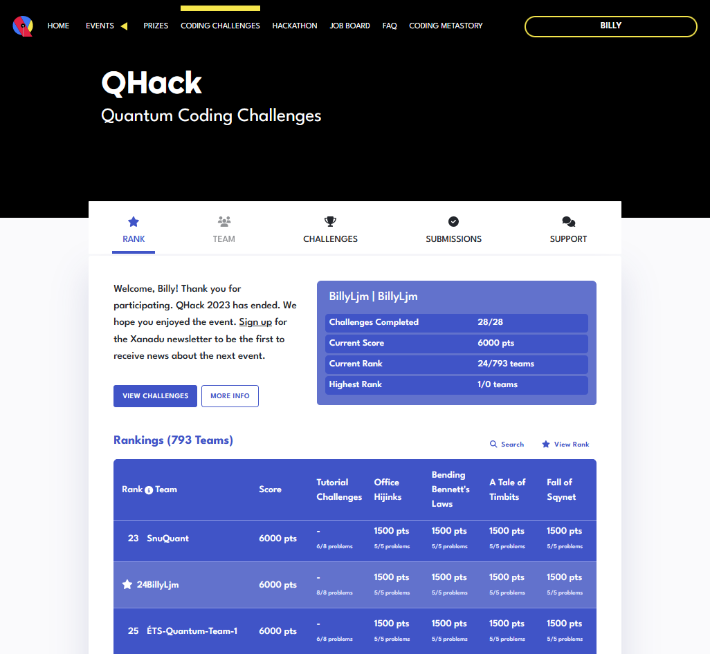

  
  
## Introduction  
Hi, these are my solutions to the [QHack 2023](https://qhack.ai) quantum machine learning hackathon.  
Everything is coded in Xanadu's [PennyLane](https://pennylane.readthedocs.io) quantum programming package.  
  
## Hackathon Details  
__Site:__ [QHack.ai](https://qhack.ai)  
__Date:__ February 2023  
  
## Score  
Here is a screenshot of my completed hackathon scoreboard entry.  
I ranked 24th in terms of cumulative completion time for the problem sets.  
  
I solved all the challenges, but started a few days late and lost a few spots there. Oh well.  
  
## Files  
There are several challenges, each in the form of a self-contained `.ipynb` in the [`ipynb`](./ipynb/) folder.  
These challenges also have an overarching storyline, as introduced in [`coding_metastory.md`](coding_metastory.md), which flow from the notebook 1.1 to 1.2, 1.3, ..., 1.5, 2.1, ...  
They are also `html` copies in the `html` folder.  
  
## Topics  
0. Tutorial Challenges  
    1. [`0.1-It Adds Up`](ipynb/0.1-It_Adds_Up.ipynb)-jupyter notebook  
    2. [`0.2-Affairs of State`](ipynb/0.2-Affairs_of_State.ipynb)-Quantum States  
    3. [`0.3-A Shor Thing`](ipynb/0.3-A_Shor_Thing.ipynb)-Shor Code  
    4. [`0.4-Product Management`](ipynb/0.4-Product_Management.ipynb)-Product States  
    5. [`0.5-Hi, Hydrogen!`](ipynb/0.5-Hi,_Hydrogen!.ipynb)-VQE: Variational Quantum Eigensolver  
    6. [`0.6-Hamiltonian Sandwich`](ipynb/0.6-Hamiltonian_Sandwich.ipynb)-Hamiltonians  
    7. [`0.7-Optimize This`](ipynb/0.7-Optimize_This.ipynb)-Quantum Machine Learning  
    8. [`0.8-Stuck in the Middle with U`](ipynb/0.8-Stuck_in_the_Middle_with_U.ipynb)-Mid-Circuit Measurements  
1. Office Hijinks  
    1. [`1.1-Tick-Tock Bloch`](ipynb/1.1-Tick-Tock_Bloch.ipynb)-Bloch Sphere  
    2. [`1.2-The Super Parameter`](ipynb/1.2-The_Super_Parameter.ipynb)-Expressibility of Circuit Ansatz  
    3. [`1.3-The Change of Qubit`](ipynb/1.3-The_Change_of_Qubit.ipynb)-Swapping States  
    4. [`1.4-The Lazy Colleague`](ipynb/1.4-The_Lazy_Colleague.ipynb)-Grover Search  
    5. [`1.5-The False Proof`](ipynb/1.5-The_False_Proof.ipynb)-Phases of Quantum States  
2. Bending Bennett's Laws  
    1. [`2.1-Ctrl-Z`](ipynb/2.1-Ctrl-Z.ipynb)-Quantum AND Gate  
    2. [`2.2-Sub-Superdense Coding`](ipynb/2.2-Sub-Superdense_Coding.ipynb)-Superdense Coding  
    3. [`2.3 Secrets in Spacetime`](ipynb/2.3-Secrets_in_Spacetime.ipynb)-Quantum Encrypthon  
    4. [`2.4-A Halfway-Decent Photocopier`](ipynb/2.4-A_Halfway-Decent_Photocopier.ipynb)-Quantum Teleportation  
    5. [`2.5-The Itch to Switch`](ipynb/2.5-The_Itch_to_Switch.ipynb)-Quantum Teleportation  
3. A Tale of Timbits  
    1. [`3.1-The Magic 5-Ball`](ipynb/3.1-The_Magic_5-Ball.ipynb)-Bernstein-Vazirani Algorithm  
    2. [`3.2-Cascadar`](ipynb/3.2-Cascadar.ipynb)-Tiffoli Gates  
    3. [`3.3-A Pauli-Worded Problem`](ipynb/3.3-A_Pauli-Worded_Problem.ipynb)-Noise, Trace Distance  
    4. [`3.4-Entangled Robot Swarms`](ipynb/3.4-Entangled_Robot_Swarms.ipynb)-Quantum Teleporation  
    5. [`3.5-One-Bit Wonder`](ipynb/3.5-One-Bit_Wonder.ipynb)-Timbits, Boolean Satisfiability Problem  
4. Fall of Sqynet  
    1. [`4.1-SqyTrotter`](ipynb/4.1-SqyTrotter.ipynb)-Trotterisation  
    2. [`4.2-Unitary Operators and Beyond`](ipynb/4.2-Unitary_Operators_and_Beyond.ipynb)-Sum of Unitaries  
    3. [`4.3-Don't Hit the Ground`](ipynb/4.3-Don't_Hit_the_Ground.ipynb)-Noise Modelling  
    4. [`4.4-Desperate Measures`](ipynb/4.4-Desperate_Measures.ipynb)-Trotter Ising Model  
    5. [`4.5-Ising Uprising`](ipynb/4.5-Ising_Uprising.ipynb)-VQE Ising Model  